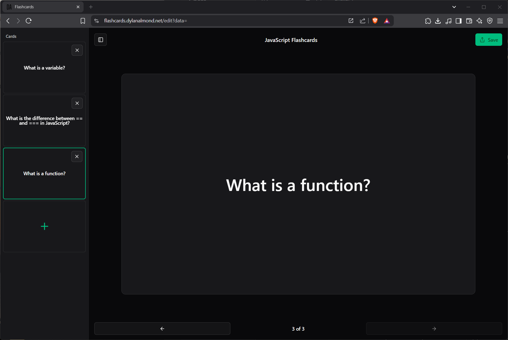

# Flashcard Tool

[](LICENSE)

A simple, web-based flashcard tool for building, viewing, and sharing flashcards.



## Table of Contents

- [Flashcard Tool](#flashcard-tool)
  - [Table of Contents](#table-of-contents)
  - [Current Features](#current-features)
  - [Planned Features](#planned-features)
  - [Prerequisites](#prerequisites)
  - [Installation](#installation)
  - [License](#license)

## Current Features

- Build custom flashcard sets in-browser
- View flashcards from a shareable URL or QR code
- Flashcard schema validation using Zod
- Fully client-side (no server or database)

## Planned Features

- Flashcard variants (pick a choice, text input, etc.)
- Client-side scoring system + progress tracking
- Embed images and/or video into Flashcards

## Prerequisites

Make sure the following are installed before running the app:

- **Node.js** (v16 or higher)
- **Yarn** (as the package manager)

## Installation

1. **Clone the Repository**

   ```bash
   git clone https://github.com/DylanAlmond/flashcards.git
   cd flashcards
   ```

2. **Install Dependencies**

   ```bash
   yarn install
   ```

3. **Start the Development Server**

   ```bash
   yarn dev
   ```

## License

This project is licensed under the [MIT License](LICENSE).
